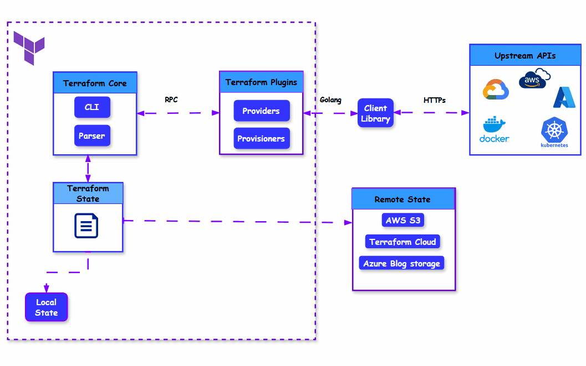

# 14-Day Terraform Challenge From Beginner to Expert: Day-1 Terraform Fundamentals


## Day 1: Terraform Fundamentals
**Estimated Time**: 3 hours

## Topics:
- Introduction to Infrastructure as Code (IaC)
- Terraform architecture and workflow
- Installing Terraform
- Basic Terraform commands
- HCL syntax fundamentals
- Project: "Hello, Infrastructure!"
 

## Introduction to Infrastructure as Code (IaC)
**Duration: 30 minutes**
### What is infrastructure as code (IaC)?

Infrastructure as Code (IaC),  is an  approach  to managing and provisioning infrastructure by writing  code instead of manual the processes, "ClickOps". IaC can be described as  the  mindset where you treat all  aspects of operations (servers, databases, networks) as software.Instead of manually configuring resources through console interfaces or ad-hoc scripts, IaC allows you to define infrastructure using code, bringing software development practices to infrastructure management. When you  define your  infrastructure using code , it   enables you to  automate and use all the best practices of software development. IaC eliminates human errors , speeds up infrastructure deployments  and ensures infrastructure is version-controlled, just like software code. 

 

### What are the benefits of using IaC
  - **Consistency**: Eliminates configuration drift and ensures consistent environments
  - **Repeatability**: Easily recreate environments with the same configurations
  - **Scalability**: Efficiently scale infrastructure by replicating configurations
  - **Version Control**: Track changes, rollback when needed, and understand the evolution of your infrastructure
  - **Documentation**: The code itself serves as documentation for your infrastructure
   other benefits include, speed and safty, and  easy documentation 

### Declarative vs Imperative Approaches
  Understanding the difference between specifying "what" you want (declarative) versus "how" to create it (imperative). With declarative code  you  declare the end state that you  want and the tool will take all the necessory steps to get to the desired state.


### IaC Tools Landscape
- **Configuration management tools (Chef, Puppet, Ansible):** As configuration management tools, Chef, Puppet, and Ansible are designed to install and maintain software on servers. 
- **Provisioning tools (Terraform, CloudFormation,  Pulumi ):**    These tools are reponsible for creating infrastructure resources(Servers, databases, caches, load balancers,)
- **Ad hoc scripts  (e.g., Bash, Ruby, Python):** Ad hoc scripts work well for short-term, one-time tasks, but if you plan to manage your entire infrastructure as code, it is best to  utilise an IaC tool designed specifically for that purpose.
- **Server templating tools:(Docker, Packer,  Vagrant.)** Server templating tools are great for creating VMs and containers. 
- **Orchestration tools:(Kubernetes,Marathon/Mesos,Docker Swarm,  Nomad)**:
 

### What is  Terraform?
Terraform, an open-source tool developed by  HashiCorp and   the most popular and widely used IaC tool by  DevOps, SREs and cloud architects. Terraform is widely used because of it's declarative syntax, platform agnostic and its simplicity.


## Terraform Architecture and Workflow
Terraform follows a well-defined architecture and workflow that enables its powerful infrastructure management capabilities.
**Duration: 25 minutes**
### Terraform Architecture


Terraform follows a standard architecture to fulfill the necessary IaC tasks. Terraform architecture mainly consists of the following components:
- 1  Terraform core
- 2  Plugins (Providers and Provisioners) 
- 3  Terraform State

####  1. Terraform core
Terraform core is the engine/brain behind how terraform works. It is responsible for  reading configurations files ,  building the dependency graphs from resources and data sources, managing state and applying changes. Terraform Core does not directly interact with cloud providers but communicates with plugins via remote procedure calls (RPCs) and the plugins in turn communicates with their corresponding platforms via HTTPs.  


#### 2. Plugins (Providers and Provisioners)

Terraform ability is  enhance  by plugins, which enable terraform  to interact with cloud services and configure resources dynamically. Plugins acts as connectors or the glue between terraform and external APIs such as AWS, Azure, GCP, Kubernetes, Docker etc. Each plugin is written in the  Go programming language and implements a specific interface. Terraform core knows how to install and execute  plugins. Provisioners in Terraform are used to execute scripts or commands on a resource after it has been created or modified. 


#### 3. Terraform State 
 State is one of the most important core components of Terraform. Terraform state is a record about all the infrastructure and resources  it created. It is a customed  JSON file that terraform uses to  map real world resources to your configuration, keep track of metadata, and to improve performance for large infrastructures. By  default, state is stored  in a local file named "terraform.tfstate". You can read more about terraform state [here](https://developer.hashicorp.com/terraform/language/state)
 
 There are two ways to manage state:
 - 1. Local State:  Local State refers to the default way by which Terraform stores state files (terraform.tfstate).  It is suitable for small-scale projects or development environments and single person is managing Terraform. 


 
 - 2. Remote State: Remote State refers to storing the Terraform state file (terraform.tfstate) in a remote backend rather than locally on your machine. This enables collaboration, prevents state loss, and supports features like state locking and versioning. Some common remote backends include AWS S3,Terraform Cloud, Azure Blob Storage etc. [Remote State](https://developer.hashicorp.com/terraform/language/state/remote)

### Terraform Workflow
Terraform follows a structured execution flow to provision, update, and manage infrastructure. This process ensures that infrastructure is deployed in a controlled and predictable manner. Terraform workflow consist of mainly five steps:

- **Write/Define Infrastructure**: The first step is to write your terraform configuration code using HashiCorp Configuration Language (HCL) just like any other software code. 
- **Initialize**:Downloads the required plugins and set up the Terraform working directory.Terraform's init command is typically used to achieve this.
- **Plan**: This is the step where you review your configurations. Terraform  plan will define the infrastructure be created, modified, or destroyed depending on the current configuration and infrastructure.
- **Apply**: The final step in the workflow is Apply,  where you are ready to provision real infrastructure. Once your approve of the changes ,terraform will go ahead  perform the desired actions as defined in defined execution order
- **Destroy**: Remove infrastructure when no longer needed

### Terraform Core Concepts
- **Resources**: Infrastructure objects managed by Terraform
- **Data Sources**: Information queried from providers
- **Providers**: Plugins for interfacing with different platforms
- **Modules**: Reusable configuration components

## Installing Terraform
**Duration: 30 minutes**

**Installation Methods**:
Setting up Terraform properly is crucial for a smooth development experience. You can install Terraform using two methods, Manual Installation using  binaries or using Package Managers.
- **Manual Installation**:
  - Downloading binaries from HashiCorp website
  - Set up PATH environment variable
  - Verify terraform is properly installed `terraform version`
- **Package Managers**:
  - Installation via apt, yum, brew, chocolatey, etc.  
  - Verify terraform is properly installed `terraform version`
To learn more about installing and setting up terraform visit the official [Install Terraform](https://developer.hashicorp.com/terraform/install). 

**NOTE** You can manage terraform versions using **Terraform Version Manager (tfenv)** [Manage Terraform versions](https://developer.hashicorp.com/terraform/tutorials/configuration-language/versions).  

**IDE Integration**:
- VSCode with Terraform extension
- IntelliJ with Terraform plugin
- Benefits of IDE integration (syntax highlighting, code completion, etc.)

## Basic Terraform Commands
**Duration: 30 minutes**
Terraform offers a rich CLI with various commands for managing your infrastructure.This section introduces some everyday commnds

**Core Commands**:
- **`terraform init`**: Initializes a working directory, downloads providers
  - When to run init (new project, new modules, new providers)
  - Init options (backend configuration, plugin selection)
- **`terraform plan`**: Shows execution plan without making changes
  - Reading plan output effectively
  - Detecting potential issues before applying
- **`terraform apply`**: Creates or updates infrastructure
  - Understanding apply output
  - Approving changes and auto-approve option
- **`terraform destroy`**: Removes previously-created infrastructure
  - Targeted destroy vs. complete destruction
  - Safety mechanisms

**Additional Useful Commands**:
- **`terraform validate`**: Validates configuration files
- **`terraform fmt`**: Formats configuration files
- **`terraform show`**: Displays current state or plan
- **`terraform output`**: Displays outputs from state
- **`terraform state`**: Advanced state management

## HCL Syntax Fundamentals
**Duration: 35 minutes**

HashiCorp Configuration Language (HCL) is Terraform's domain-specific language designed for creating structured configuration files.
The Terraform language syntax is built around two key syntax constructs: arguments and blocks

```hcl
<BLOCK TYPE> "<BLOCK LABEL>" "<BLOCK LABEL>" {
  # Block body
  <IDENTIFIER> = <EXPRESSION> # Argument
}
```

- **1. Blocks**: A block  acts as a containers  for other content. Some types of blocks are:
  - 1 resource, 
  - 2. provider,
  - 3. variable,
  - 4. output,
  - 5. data.
- **2. Arguments**: Assign values to names


BLOCK TYPE:
BLOCK LABEL:
IDENTIFIER:
EXPRESSION:

 - **Expressions**: Used to reference or compute values
  ```hcl
  count = var.instance_count
  ```

**Examples**: 
 ```hcl
    resource "aws_instance" "webserver" {
    ami           = "ami-0c55b159cbfafe1f0"
    instance_type = "t2.micro"
  }
  ```


**Special Syntax**:
- **Comments**: Single-line (`#`, `//`) and multi-line (`/* */`)
- **Heredoc Syntax**: For multi-line strings
- **Interpolation**: Using `${}` to embed expressions in strings
- **Conditional Expressions**: Using the ternary operator `condition ? true_val : false_val`

- **Best Practices for File Organization**:
  - Using `.tf` extension
  - Common file names (main.tf, variables.tf, outputs.tf)
  - Organizing code for readability


## Project: "Hello, Infrastructure!"

For this project, you'll create a simple Terraform configuration that provisions a basic cloud resource:

1. Install Terraform on your local machine
2. Set up cloud provider credentials (AWS, Azure, or GCP)
3. Create a basic configuration file to provision a simple resource (e.g., S3 bucket)
4. Initialize Terraform, create a plan, and apply the configuration
5. Verify the resource was created successfully
6. Destroy the resources when finished


